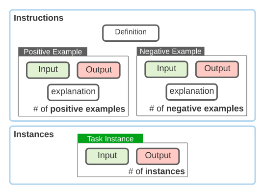

# A Repository of Language Instructions for NLP Tasks

**TLDR;** this repository maintains a community effort to create a large collection of tasks and their natural language definitions/instructions. 
Check the [releases](https://github.com/allenai/natural-instructions-expansion/releases) for the summary of the latest changes and additions to the tasks.  
If you have any suggestions to improve the data, let us know. We're looking for more contributions to make this data better and bigger! 🙌  

### News Bulletin

- *May 2022:* We released the several models trained on our data. Check out the [code](https://github.com/yizhongw/Tk-Instruct) and [checkpoints](https://huggingface.co/models?search=tk-instruct-).
- *April 2022:* A [paper]( https://arxiv.org/abs/2204.07705) on our data is out!
- *October 15, 2021:* the goal date for the our v2 dataset.
  - The community have contributed over 1500 tasks!! 🎉
  - We are working on cleaning up the new tasks and publishing a paper summarizing our new findings!
  - You can still submit new tasks! The new tasks will be part of the future data releases.
- *Sept 2021*: general [call for contributions](https://medium.com/ai2-blog/call-for-contributions-a-community-driven-repository-of-natural-language-instructions-9d3f24d5a9db) is out!
- *June 2021:* we initiated this repository with 61 tasks!

## Background 
### Why define tasks in natural language?
While the current dominant paradigm (supervised learning with task-specific labeled examples) has been successful in building task-specific models, such models can't generalize to unseen tasks; for example, a model that is supervised to solve questions cannot solve a classification task. 
We hypothesize that a model equipped with understanding and reasoning with natural language instructions should be able to generalize to any task that can be defined in terms of natural language.

### Any empirical evidence that this might be true?
In our [earlier effort](https://arxiv.org/abs/2104.08773), we built a smaller data (61 tasks) and 
observed that language models benefit from language instructions, i.e., their generalization to unseen tasks when they were provided with more instructions.  
Also, generalization to unseen tasks improves as the model is trained on more tasks.

### Why build this dataset?  
We believe that [our earlier work](https://arxiv.org/abs/2104.08773) is just scratching the surface and there is probably so much that be studied in this setup.
We hope to put together a much larger dataset that covers a wider range of reasoning abilities. 
We believe that this expanded dataset will serve as a useful playground for the community to study and build the next generation of AI/NLP models.
See [this blog post](https://medium.com/ai2-blog/call-for-contributions-a-community-driven-repository-of-natural-language-instructions-9d3f24d5a9db) for a summary of the motivation behind this work.


## Task schema  
Each consists of input/output. For example, think of the task of sentiment classification:  
 - **Input:** `I thought the Spiderman animation was good, but the movie disappointed me.`
 - **Output:** `Mixed` 

Here is another example from the same task: 
 - **Input:** `The pumpkin was one of the worst that I've had in my life.` 
 - **Output:**  `Negative`  

Additionally, each ask contains a task *definition*: 
```
Given a tweet, classify it into one of 4 categories: Positive, Negative, Neutral, or Mixed.
``` 

Overall, each tasks follows this schema:
 
 

Or if you're comfortable with json files, here is how it would look like: 
```json 
{
  "Contributors": [""],
  "Source": [""],
  "URL": [""],
  "Categories": [""],
  "Reasoning": [""],
  "Definition": [""],
  "Input_language": [""], 
  "Output_language": [""],
  "Instruction_language": [""],  
  "Domains": [""],    
  "Positive Examples": [ { "input": "", "output": "",  "explanation": ""} ], 
  "Negative Examples": [ { "input": "", "output": "",  "explanation": ""} ],
  "Instances": [ { "id": "", "input": "", "output": [""]} ],
}
```

## How to contribute 
We would appreciate any external contributions! 🙏 You can contribute in a variety of ways. 
 - If you think an important task is missing, you can contribute it via Pull-Request.  You can also get inspirations from the task suggestions in [the Github issues](https://github.com/allenai/natural-instructions-expansion/issues?q=is%3Aissue+is%3Aopen+label%3Atask-suggestion) which you can sign up to work on. 
 - If you have any other suggested tasks but you're not sure if they're good fit, bring them up in the [issues](https://github.com/allenai/natural-instructions-expansion/issues).  
 - If you have any questions or suggestions, please use [the issues](https://github.com/allenai/natural-instructions-expansion/issues) feature.  
 - If you're addimg a new task, make sure to review the following guidelines: 
    * Each task must contain contain a `.json` file that contains the task content. You can look inside the [`tasks/`](tasks) directory for several examples.  
       * Make sure that your json is human readable (use proper indentation; e.g., in Python: `json.dumps(your_json_string, indent=4, ensure_ascii=False)`)   
       * Make sure that you json file is not bigger than 50MB. 
       * Make sure your task has no more 6.5k instances (input/output pairs).
       * Each instance must have a unique id, which should be the task number plus a string generated by `uuid.uuid4().hex`. E.g., `task1356-bb5ff013dc5d49d7a962e85ed1de526b`.
       * Make sure to include task category and domains, based on [this list](doc/task-hierarchy.md). 
       * Make sure to number your task json correctly 
          * Look at the task number in the latest pull request, task number in your submission should be the next number. 
          * Make sure to include the source dataset name and the task type when naming your task json file. 
             * You can use this format: `taskabc_<source_dataset>_<task_type>.json` E.g. in `task001_quoref_question_generation.json`, the source dataset is `quoref` and the task is `question generation`. 
       * Note that, source need not necessarily be a dataset and can be a website e.g. leetcode. 
          * If you have created the json without any reference, use `synthetic` in place of source.
       * You should have one pull request per dataset. Name your pull request as `Task Name <start_task_number>-<end_task_number>`.
       * If you're building your tasks based existing datasets and their crowdsourcing templates, see these [guidelines](doc/crowdsourcing.md). 
    * Add your task to [our list of tasks](tasks/README.md).
    * To make sure that your addition is formatted correctly, run the tests: `> python src/test_all.py`
       * To only test the formatting of a range of tasks, run `> python src/test_all.py --task <begin_task_number> <end_task_number>`. For example, running `> python src/test_all.py --task 5 10` will run the test from task005 to task010.

## Benchmarking cross-task generalization

As is introduced in our [paper](https://arxiv.org/abs/2204.07705), this dataset can be used for systematic study of cross-task generalization, i.e., training on a subset of tasks and evaluating on the remaining unseen ones. To make the comparison among different methods easier, we create an official split [here](splits/), as is described in the paper. You can follow the instructions to set up your experiments.

We also released our [experiment code](https://github.com/yizhongw/Tk-Instruct) and [checkpoints](https://huggingface.co/models?search=tk-instruct-) for reproducibility and future research.

## License 
All the data here (except the instances of each task) are released under Apache-2.0 license. 
The instances of each tasks are subject to the license under which the original dataset was released. 
These license information are available unders "Instance License" field within each task file. 


## Misc.

If you want to use Natural Instructions v1, here's the code: [link](https://github.com/allenai/natural-instructions-v1)

Feel free to cite us. 

```bibtex
@inproceedings{naturalinstructions,
  title={Cross-task generalization via natural language crowdsourcing instructions},
  author={Mishra, Swaroop and Khashabi, Daniel and Baral, Chitta and Hajishirzi, Hannaneh},
  booktitle={ACL},
  year={2022}
}
@inproceedings{supernaturalinstructions,
  title={Super-NaturalInstructions:Generalization via Declarative Instructions on 1600+ Tasks},
  author={Wang, Yizhong and Mishra, Swaroop and Alipoormolabashi, Pegah and Kordi, Yeganeh and Mirzaei, Amirreza and Arunkumar, Anjana and Ashok, Arjun and Dhanasekaran, Arut Selvan and Naik, Atharva and Stap, David and others},
  booktitle={EMNLP},
  year={2022}
}
```
